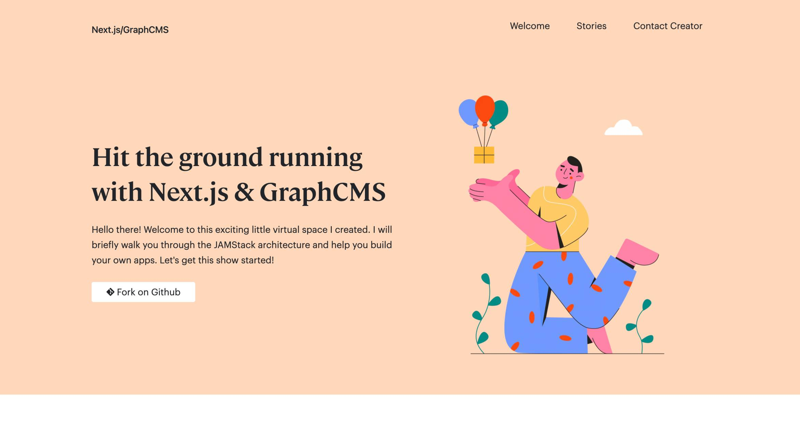

<h1>Introduction</h1>
<p>Hello there! Welcome to this exciting little virtual space I created. I've put in some time to create content that will briefly walk you through the JAMStack architecture and help you build your own apps. Let's get this show started!</p>
<br />

<br />

<h1>Technologies</h1>
<table style="margin-bottom:2em">
  <tbody>
    <tr >
		<td style="padding-bottom: 2em;">
			
			<h2>GraphCMS</h2>
			<p>This is our data powerhouse. <a href="https://graphcms.com" target="_blank">GraphCMS</a> is a very powerful and yet easy to use Headless CMS with tons of useful options to support different projects.</p>
		</td>
		<td style="padding-bottom: 2em;">
			
			<h2>Next.js</h2>
			<p>An amazing <a href="https://nextjs.org/" target="_blank">React framework</a> that straps everything together, providing us with all the necessary dependencies and project configurations to start coding right away.</p>
		</td>
		<td style="padding-bottom: 2em;">
			
			<h2>Apollo GraphQL Client</h2>
			<p>Of course, I was not going to build a <a href="https://jamstack.org/" target="_blank">Jamstack</a> project and leave out our beloved <a href="https://www.apollographql.com/docs/react/" target="_blank">Apollo</a> GraphQL client library, nope!  I love the way this thing works.</p>
		</td>
    </tr>
    <tr>
        <td style="padding-bottom: 2em;">
			
			<h2>Bootstrap</h2>
			<p>We cannot deny the simplicity that <a href="https://getbootstrap.com/" target="_blank">Boostrap</a> brings to Frontend work. Well... Some of us can deny that, but who cares? I installed and used Bootstrap 5 on this project.</p>
		</td>
        <td style="padding-bottom: 2em;">
			
			<h2>Sass</h2>
			<p>There are lots of reasons why <a href="https://sass-lang.com/" target="_blank">Sass</a> is referred to as CSS with superpowers. You might find a few if you have a look into <code><b>root/styles</b></code> directory.</p>
		</td>
        <td style="padding-bottom: 2em;">
			
			<h2>Vercel</h2>
			<p>Last but not the least... Can you take a guess on where this beautiful piece of work was deployed? That is right, <a href="https://vercel.com/" target="_blank">Vercel!</a> </p>
		</td>
    </tr>
  </tbody>
</table>


<div style="margin-bottom:2em">


# Getting Started

First, run the development server:

```bash
npm run dev
# or
yarn dev
```

Open [http://localhost:3000](http://localhost:3000) with your browser to see the result.

You can start editing the page by modifying `pages/index.js`. The page auto-updates as you edit the file.
</div>


<div style="margin-bottom:2em">

# Learn More About Next.js Here

To learn more about Next.js, take a look at the following resources:

- [Learn Next.js](https://nextjs.org/learn) - an interactive Next.js tutorial.
- You can check out [the Next.js GitHub repository](https://github.com/vercel/next.js/) - your feedback and contributions are welcome!
</div>


<div style="margin-bottom:2em">

# Special Thanks To

[ Vercel ](https://vercel.com/) for sponsoring this project's hosting

[](https://vercel.com/import/git?s=https://github.com/shal0mdave/nextjs-graphcms&project-name=next-graphfy&repo-name=nextgraphify)

[ GraphCMS ](https://graphcms.com/) for sponsoring this project's CMS

[](https://graphcms.com/)

</div>

<!-- # Learn More About Next.js Here -->
